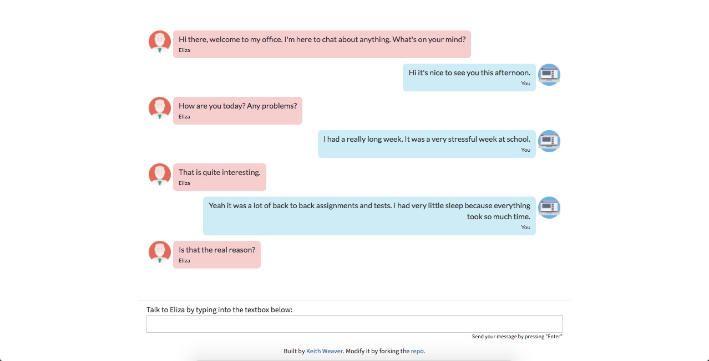

# eliza




### About

This is an implementation of Eliza built in pure Javascript. I wanted to build it on a MERN stack but my starting point is in just JS. You can find a more indepth description below.


ELIZA is an early natural language processing computer program created from 1964 to 1966[1] at the MIT Artificial Intelligence Laboratory by Joseph Weizenbaum. Created to demonstrate the superficiality of communication between man and machine, Eliza simulated conversation by using a 'pattern matching' and substitution methodology that gave users an illusion of understanding on the part of the program, but had no built in framework for contextualizing events. The most famous script, DOCTOR, simulated a Rogerian psychotherapist and used rules, dictated in the script, to respond with non-directional questions to user inputs. As such, ELIZA was one of the first chatterbots, but was also regarded as one of the first programs capable of passing the Turing Test. (Taken from [Wiki](https://en.wikipedia.org/wiki/ELIZA))


### Running

You have two options:

**Option #1:**
It's hosted on Github Pages at http://keithweaver.github.io/eliza/.


**Option #2:**
Just open the index HTML file on your local machine, so [this one](./index.html).


### Why Javascript?

I decided to build out my implementation of Eliza in Javascript because it can be run on most computers, using most browsers. There's no installation time and I include the dependencies in the index.html. I can also create a Github Pages demo forever.


### File Structure

```
- index.html
- README.md
assets    css
		  imgs

js  	- actions.js 		// All UI related functions and actions
		- notifications.js  // Allows me to create dynamic notifications for informing user
		- demo.js 			// Runs a few example inputs
		- eliza.js 			// The actual eliza implementation
```


### Explanation

The program has been built with two major steps; start and send new message. The start function runs once the page is loaded. It begins by creating a list of keywords based on a pre-determined list of responses and a pre-determined list of similar words. An example of a response:

```
var responses = {
"sorry" : {
				 "weight" : 1,
				 "responses" : ["Please don't apologize.", "Apologies are not necessary.", "Apologies are not required."]},
...
```

An example of a similar word:
```
var synonyms = {
	"sorry" : [
		"apologise"
	],
...
```

The idea is instead of repeating exact responses for multipe words like `sorry` and `apologise` or `youre` and `you're`. It uses the list of synonyms object to find responses in advance of any messages. After all potential keywords are added with their weight, the keyword list is sorted from on highest weighed to lowest. The weight better determines relevance towards particular subjects like family or computer. It next adds the first message to begin the conversation. *"Hello. How are you feeling today?"*


The program using jQuery to determine when the window loads and when there is a new input. A user simply has to type a new message into the textbox and presses enter. This eliminates the need for continuous looping. When a user sends a new message to Eliza, the program verifies the textbox is not blank and adds to the UI before beginnig to analyze the string for a response.


```
function sendElizaNewMessage(newMessage){
	
	//Add to UI
	chatHistory.push({ isEliza : false, content : newMessage });
	displayChat();
	clearSendTextbox();

	if(!conversationOver){
		//Makes it lower case
		newMessage = processInput(newMessage);
		//Find the response based on the input. Check the analyze docs
		var response = analyze(newMessage);
	}else{
		var response = "Our conversation has ended. Refresh the page to start again.";
	}

	//Shows the reply from Eliza. To make it seem more real, takes a
	//random short time to response. Reloads the chat.
	setTimeout(function(){
		usedResponses.push(response);
		chatHistory.push({ isEliza : true, content : response });
		displayChat();
	}, determineResponseTime());

}
```

The purpose of the analyze function is to find an appropriate response based on the input string, the weight of the keywords, the past chat messages, a degree of randomness and the engagement from the response. The program looks for a wildcard in the keyword or just the keyword and starts with the most heavily weighted and working down. 


If a term is found and has a wildcard, it begins determining whether or not it matches the rules associated with that wildcard. An example is `i am *1-3* happy` which is similar to `i am happy` but a user may say something like `I am extremely happy`. The program checks to see that keywords `i`, `am`, and `happy` exists and are in the proper order. The program also verifies the wild card rules. In this example, there can be 1 to 3 words between `am` and `happy`. If there are more or less, it does not count as a found keyword. The implementation helps managed a variety of sentences like `i am extremely happy` works but `I am sad because I am not happy` does not. When the program recognizes the valid keywords with a wildcard, it replaces it with a keyword with a response and continues to the `selectResponse` function. An example, `i am extremely happy` finds a response with `i am happy`.


If a term is found without a wildcard, and that term does not represent goodbye, it continues to find a response.


The `selectResponse` uses all attributes mentioned before to determine the optimal and most realistic response. It first gathers a list of possible responses for that keyword. The program then looks for a response containing a wild card subject or a response that has not been used before. If it matches either it adds a duplicate to the list of responses to increase the odds of them occurring. The use of a wild card makes it a more engaging conversation being able to reply with the context and content from the known information. In the example below it takes the response `Have you ever fantasized about * while you were awake?` and the program knows to replace the `*` with the incoming content.


Example of a wild card: (Dream is the keyword)

```
User> I had a dream last night about my dog eating my homework
Eliza> Have you ever fantasized about your dog eating your homework while you were awake?
```


Another way `selectResponse` increase the realness to Eliza is by storing past responses and minimizing the amount of repeated content. A therapist may repeat their questions but commonly they ask a variety of questions. The last step for `selectResponse` is a degree of randomness to continuously change the questions coming from Eliza.


```
function selectResponse(word){
	var potentialResponses = [];
	if(word in responses){
		//Easily find responses by using key value pairing
		potentialResponses = responses[word];
	}else{
		//Need to find the related responses
		potentialResponses = findResponsesForSimilarWord(word);
	}

	
	var newResponses = [];
	var originalResponsesSize = potentialResponses.responses.length;


	for(var i = 0;i < originalResponsesSize;i++){
		newResponses.push(potentialResponses.responses[i]);

		//If has wild card, adds another
		if(potentialResponses.responses[i].indexOf("*") !== -1){
			newResponses.push(potentialResponses.responses[i]);
		}

		//If the response hasnt been used
		if(!usedResponses.contains(potentialResponses.responses[i])){
			newResponses.push(potentialResponses.responses[i]);
		}
	}
	
	return newResponses[Math.floor(Math.random()*newResponses.length)];
}
```


Looking back at the `analyze` function, the program now has a response. This response could potentially have a wild card. If no wild card is found, the function simply just returns the response from Eliza. If no response is found, there are a list of responses that encourage the user to continue provide more information. However if a wild card is found it begins to insert the contents into the response. The first step is to take the content to the right of the keyword in the incoming message. The second step is to split the response in two around the * (and excludes it). The third step is to paste the pieces together in the proper order. There is an example included in the comments of the code. During the pasting portion, we modified the contents of the user input with the `replaceWords` function. In the `replaceWords` function, we change the perspective of the content to Eliza's point of view as compared to the users. As you can see below we change "my" to be "your", "I" to be "you", etc. This is so the reply does not seem like Eliza is simply returning the input.

```
function analyze(newMessage){
	var found = false;
	var response = '';

	//Check all
	for (var i = 0;i < keywords.length;i++) {
		var word = keywords[i].word;
		
		if(endChatTerms.contains(newMessage)){
			conversationOver = true;
			newMessage = "goodbye";
		}

		//Check for a wild card in the keyword
		//If yes then its a keyword with an adjective like "i am *1-3* happy"
		//Also checks if the newMessage contains all parts in proper order and following
		//the rules
		if(word.indexOf("*") != -1 && containsKeywordWithWildcard(newMessage, word) && !found){
			
			response = selectResponse(findBasicKeywordFromKeywordWithWildcard(word));
			found = true;

		}else if((newMessage.indexOf(word) != -1 && newMessage.length == word.length || newMessage.indexOf(word + " ") != -1 || newMessage.indexOf(" " + word) != -1) && !found){
			//Check to see if the keyword is in the sentence
			//Ex. input is "Hi" or "This and more" or "Hi doc!"
			
			//This picks a response
			response = selectResponse(word);
			
			//Check for wild card
			found = true;

		}
		

		if(found && response.indexOf("*") !== -1){
				//Wild card exists so sub in the phrase
				//Ex. I had a dream about my dog.
				//Dream is the keyword
				

				//Right of the keyword in the incoming message
				var remainingInput = newMessage.substring(newMessage.indexOf(word) + word.length+1, newMessage.length);
				//RemainingInput: [about my dog]
				
				//Right of the wildcard in the response
				var rightOfWildcardInResponse = response.substring(response.indexOf("*")+1);
				//Right of Wildcard In Response: [ while you were awake?]

				//Start of the response to the wildcard
				var startOfResponseToWildcard = response.substring(0, response.indexOf("*"));
				//Start of response to wildcard: [Have you ever fantasized]

				//The start of the remainingInput to the end minus the one character
				var startOfInputMinusOneCharacter = remainingInput.substring(0, remainingInput.length-1);
				//Start of input minus one character: [about my do]

				//This is remaining of the remaining input.
				//Regular expression replaces things that are not either A-Z or a-z
				var remainingOfInputOnRight = remainingInput.substring(remainingInput.length-1, remainingInput.length).replace("[^A-Za-z]","");
				//Remaining of Input on Right: [g]


				response =  startOfResponseToWildcard + replaceWords(startOfInputMinusOneCharacter + remainingOfInputOnRight) + rightOfWildcardInResponse;
				//Response: Have you ever fantasized about my dog while you were awake?

				//Changes the words and fixes the tenses.
				//Ex. I had a dream about my dog. --> Have you ever fantasized about your dog while you were awake?
				//But it only should work on the input not the response so you apply it to the inner parts.
		}
		if(found){
			break;
		}
		

	}

	if(!found){
		response = responses["NOTFOUND"].responses[Math.floor(Math.random()*responses["NOTFOUND"].responses.length)];
	}

	return response;
}

/*
 * Replaces the context of words, flipping
 * the voice from the user to eliza.
 * 
 * It's split into an array so it doesn't
 * replace back and forth. Ex. me->i i->me
 */
function replaceWords(input){
	
	var wordsForReplacement = [];
	wordsForReplacement["i"] = "you";
	wordsForReplacement["you"] = "i";
	wordsForReplacement["me"] = "you";
	wordsForReplacement["my"] = "your";
	wordsForReplacement["am"] = "are";
	wordsForReplacement["are"] = "am";
	wordsForReplacement["was"] = "were";
	wordsForReplacement["i'd"] = "you would";
	wordsForReplacement["i've"] = "you have";
	wordsForReplacement["i'll"] = "you will";
	wordsForReplacement["you've"] = "i have";
	wordsForReplacement["you'll"] = "i will";
	wordsForReplacement["your"] = "my";
	wordsForReplacement["yours"] = "mine";
	wordsForReplacement["me"] = "you";
	//Added in after testing
	wordsForReplacement["always had"] = "always have";
	
	
	var inputSplit = input.split(" ");

	//Was having an overrite issue
	var newSplit = [];
	for(var i = 0;i < inputSplit.length;i++){
		var currentInputWord = inputSplit[i];
		if(currentInputWord in wordsForReplacement){
			var replacementWord = wordsForReplacement[currentInputWord];
			newSplit[i] = replacementWord;

			//I had a dream about my dog.
		}else{
			newSplit[i] = currentInputWord;
		}
	}

	var updatedMessage = "";
	for(var i = 0;i < newSplit.length;i++){
		var word = newSplit[i];
		if(updatedMessage != ""){
			updatedMessage += " ";
		}
		updatedMessage += word;
	}

	return updatedMessage;
}


/*
 * Checks to see if the keyword exists properly 
 * so "I am happy" is in proper order. Also 
 * checks to against runs so only so many words
 * are between "am" and "happy". So
 * "I am extremely happy" but 
 * "I am sad because I am happy" would fail.
 */
function containsKeywordWithWildcard(input, keywordsWithWildcardStr){
	
	var responseWildcardObj = getResponseWildcardInfo(keywordsWithWildcardStr);

	var numberOfWordsInWildcard = 0;
	var foundKeywords = 0;
	var inputArray = input.split(" ");
	for(var i = 0;i < inputArray.length;i++){
		var currentWord = inputArray[i];
		
		//if the word is not a keyword, add it. and we are in the wildcard
		if((foundKeywords >= responseWildcardObj.minNumWords && foundKeywords <= responseWildcardObj.maxNumWords) && !responseWildcardObj.keywords.contains(currentWord)){
			numberOfWordsInWildcard++;
		}

		if(responseWildcardObj.keywords.length > 0 && currentWord == responseWildcardObj.keywords[0]){
			//so first this would be "i" for ["i","am","happy"]
			responseWildcardObj.keywords.remove(currentWord);
			foundKeywords++;
		}
	}

	//Doesnot have all keywords
	//"I am * sad"
	//"I am * happy"
	//> I am extremely happy
	//Sad should stop here cause its not valid
	if(responseWildcardObj.keywords.length > 0){
		//console.log("Not the correct keyword");
		return false;
	}
	if(!(numberOfWordsInWildcard >= responseWildcardObj.minNumWords && numberOfWordsInWildcard <= responseWildcardObj.maxNumWords)){
		//console.log("Does not follow wildcard rules");
		return false;
	}
	
	return true;
}
```


After the program updates the chat with the new response. It waits for the next input.

